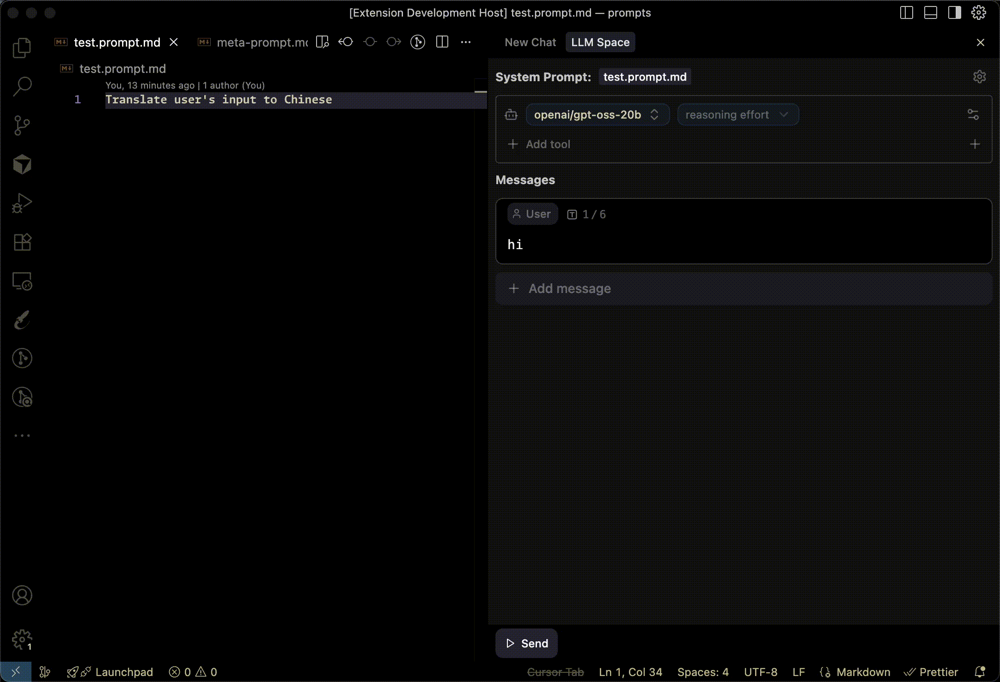

# VSCode LLM Space

<p align="center">
  
</p>

LLM Space is an AI context engineering develop assistant.

## Features

### 🤖 AI Chat Assistant

- Intelligent dialogue system based on large language models
- Support for multiple mainstream AI model integrations
- Real-time response with smooth conversation experience

### 🛠️ Development Tool Integration

- **Direct debugging of prompt files in project engineering**: Seamlessly integrated into your development workflow, supporting direct editing and debugging of prompt files within projects
- **Multi-turn conversation debugging support**: Provides complete conversation history management, supporting debugging and optimization of multi-turn conversations
- **Custom model integration configuration support**: Flexible configuration of various AI model parameters, supporting custom model integration and configuration management

### 🔧 Advanced Feature Support

- **Tools Support**: Integrated rich toolset, supporting function calls and external API integration
- **MCP (Model Context Protocol) Support**: Standardized model context protocol, ensuring compatibility with various AI services
- **Multi-modal Support**: Support for sending and receiving image messages, enhancing multi-modal interaction capabilities
- **Token Calculation**: Real-time display of token usage, helping optimize conversation costs

## Provider configuration

<p align="center">
  
</p>

## Develop

1. Install dependencies:

   ```bash
   pnpm i
   ```

1. Debug extension:

   1. Watch:

      ```bash
      npm run watch
      ```

   1. Press `F5` to run VSCode debug.

## Test

```bash
npm run test
```
